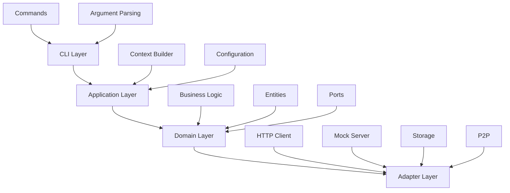
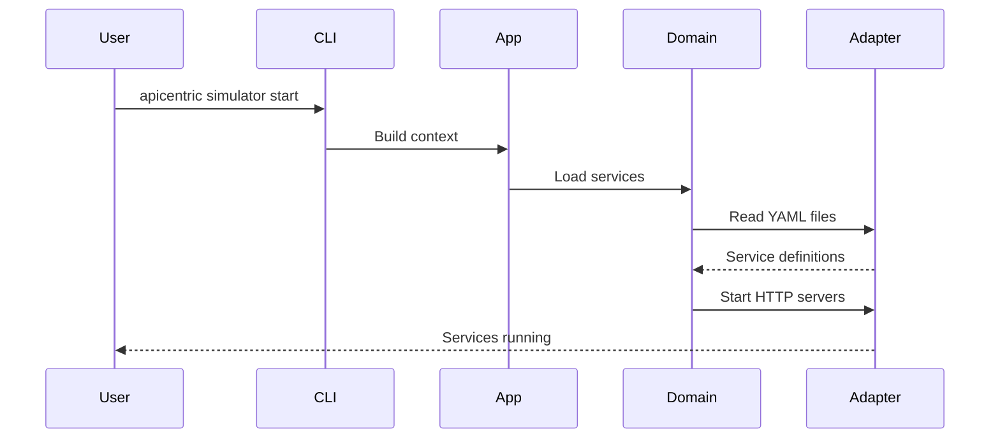
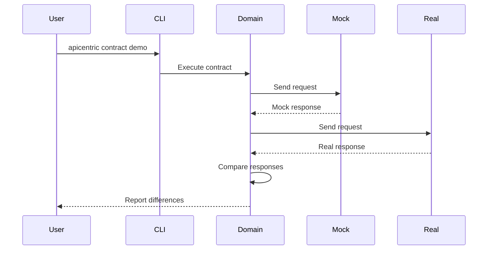

# Apicentric Architecture

This document describes the architecture and design decisions of Apicentric.

## Overview

Apicentric is built using a layered architecture that separates concerns and promotes maintainability. The system follows the ports and adapters (hexagonal) architecture pattern, with clear boundaries between layers.

## Layered Architecture



### CLI Layer

The CLI layer handles user interaction and command parsing.

**Location**: `src/cli/`, `src/commands/`

**Responsibilities**:
- Parse command-line arguments using `clap`
- Validate user input
- Dispatch commands to application layer
- Format output for users

**Key Components**:
- `mod.rs` - CLI entry point and command definitions
- `simulator/` - Simulator commands (start, stop, validate, etc.)
- `contract.rs` - Contract testing commands
- `tui.rs` - Terminal UI command
- `gui.rs` - GUI launcher command

### Application Layer

The application layer orchestrates business logic and manages application state.

**Location**: `src/app/`, `src/context/`

**Responsibilities**:
- Build execution context
- Load and validate configuration
- Coordinate between domain and adapters
- Manage application lifecycle

**Key Components**:
- `ContextBuilder` - Builds execution context with dependencies
- `ExecutionContext` - Holds application state and configuration
- `Config` - Application configuration management

### Domain Layer

The domain layer contains business logic and domain entities.

**Location**: `src/domain/`

**Responsibilities**:
- Define business entities
- Implement business rules
- Define ports (interfaces) for adapters
- Validate domain invariants

**Key Components**:

#### Entities (`src/domain/entities.rs`)
- `ServiceDefinition` - API service specification
- `Endpoint` - API endpoint definition
- `Response` - Response specification
- `Contract` - Contract testing specification

#### Ports (`src/domain/ports/`)
- `ContractRepository` - Contract storage interface
- `HttpClient` - HTTP client interface
- `SystemInterface` - System operations interface
- `UIInterface` - User interface operations

#### Business Logic
- Contract testing (`src/domain/contract/`)
- Service validation
- Scenario management

### Adapter Layer

The adapter layer implements ports and integrates with external systems.

**Location**: `src/adapters/`, `src/simulator/`, `src/storage/`

**Responsibilities**:
- Implement domain ports
- Integrate with external systems
- Handle I/O operations
- Manage infrastructure concerns

**Key Components**:

#### HTTP (`src/adapters/http_client.rs`)
- HTTP client implementation using `reqwest`
- Request/response handling
- Error mapping

#### Mock Server (`src/adapters/mock_server.rs`)
- HTTP server using `hyper`
- Request routing
- Response generation

#### Storage (`src/storage/`)
- SQLite database integration
- Contract persistence
- Configuration storage

#### Simulator (`src/simulator/`)
- Service lifecycle management
- Configuration loading
- Template rendering
- Route registry

## Feature Flag System

Apicentric uses Cargo features to make heavy dependencies optional, improving build times and binary size.

### Feature Flags

```toml
[features]
default = ["simulator"]

# Core features
simulator = []
contract-testing = ["reqwest", "async-trait"]

# Optional features
tui = ["ratatui", "crossterm", "indicatif"]
p2p = ["libp2p", "automerge", "tokio-tungstenite"]
graphql = ["async-graphql", "async-graphql-parser"]
scripting = ["deno_core"]
ai = []

# Convenience bundles
full = ["tui", "p2p", "graphql", "scripting", "ai"]
minimal = ["simulator"]
cli-tools = ["simulator", "contract-testing", "tui"]
```

### Conditional Compilation

Features are enabled using conditional compilation:

```rust
#[cfg(feature = "tui")]
pub mod tui;

#[cfg(feature = "p2p")]
pub mod p2p;

#[cfg(feature = "graphql")]
pub mod graphql;
```

This allows users to install only the features they need:

```bash
# Minimal installation
cargo install apicentric --no-default-features --features minimal

# Full installation
cargo install apicentric --features full
```

## Key Design Decisions

### 1. Ports and Adapters Pattern

**Decision**: Use hexagonal architecture with ports and adapters.

**Rationale**:
- Separates business logic from infrastructure
- Makes testing easier with mock implementations
- Allows swapping implementations without changing business logic
- Promotes loose coupling

### 2. YAML Configuration

**Decision**: Use YAML for service definitions.

**Rationale**:
- Human-readable and writable
- Widely used in DevOps tools
- Good library support in Rust
- Easy to version control

### 3. Feature Flags

**Decision**: Make heavy dependencies optional via Cargo features.

**Rationale**:
- Reduces build time for users who don't need all features
- Smaller binary size
- Faster CI/CD pipelines
- Users can choose their own trade-offs

### 4. Async Runtime

**Decision**: Use Tokio for async operations.

**Rationale**:
- Industry standard for async Rust
- Excellent ecosystem support
- Good performance characteristics
- Well-documented

### 5. Error Handling

**Decision**: Use custom error type with suggestions.

**Rationale**:
- Provides helpful error messages
- Suggests solutions to users
- Maintains error context
- Easy to extend

## Module Organization

```
src/
├── cli/              # CLI commands and parsing
├── commands/         # Command implementations
│   ├── simulator/    # Simulator commands
│   ├── contract.rs   # Contract testing
│   ├── tui.rs        # Terminal UI
│   └── gui.rs        # GUI launcher
├── app/              # Application orchestration
├── context/          # Execution context
├── domain/           # Business logic
│   ├── entities.rs   # Domain entities
│   ├── ports/        # Port definitions
│   └── contract/     # Contract testing logic
├── adapters/         # Infrastructure adapters
│   ├── http_client.rs
│   ├── mock_server.rs
│   └── contract_repository.rs
├── simulator/        # API simulator
│   ├── config/       # Configuration
│   ├── service/      # Service management
│   └── template/     # Template rendering
├── storage/          # Data persistence
└── utils/            # Utilities

```

## Data Flow

### Starting the Simulator



### Contract Testing



## Testing Strategy

### Unit Tests

- Test individual functions and modules
- Mock external dependencies
- Focus on business logic
- Located alongside source code

### Integration Tests

- Test component interactions
- Use real implementations where possible
- Test end-to-end scenarios
- Located in `tests/` directory

### Feature Tests

- Test with different feature combinations
- Ensure features work independently
- Verify conditional compilation
- Run in CI matrix

## Performance Considerations

### Build Time Optimization

- Feature flags reduce compilation units
- Dependency caching in CI
- Parallel compilation enabled by default
- Incremental compilation for development

### Runtime Performance

- Async I/O for concurrency
- Efficient template rendering
- Connection pooling for HTTP
- Bounded buffers for logs

### Memory Management

- Streaming for large files
- Bounded log buffers (max 1000 entries)
- Efficient data structures
- Minimal cloning

## Security Considerations

### Input Validation

- Validate all user input
- Sanitize file paths
- Check port ranges
- Validate YAML structure

### Sandboxing

- Deno runtime for scripts (when enabled)
- No network access from scripts
- No file system access from scripts
- Isolated execution environment

### Dependencies

- Regular security audits with `cargo audit`
- Minimal dependency tree
- Trusted crates only
- Keep dependencies updated

## Future Directions

### Planned Improvements

1. **Plugin System**: Allow users to extend functionality
2. **GraphQL Support**: Better GraphQL mocking capabilities
3. **Performance**: Optimize template rendering
4. **Documentation**: More examples and guides

### Potential Refactoring

1. **HTTP Server**: Consider migrating from hyper to axum
2. **Error Handling**: Unify error types across modules
3. **Logging**: Standardize on `tracing` crate
4. **Configuration**: Support multiple config formats

## Contributing

When contributing to Apicentric:

1. Follow the layered architecture
2. Keep business logic in the domain layer
3. Use ports for external dependencies
4. Add tests for new functionality
5. Update documentation

See [CONTRIBUTING.md](CONTRIBUTING.md) for detailed guidelines.
